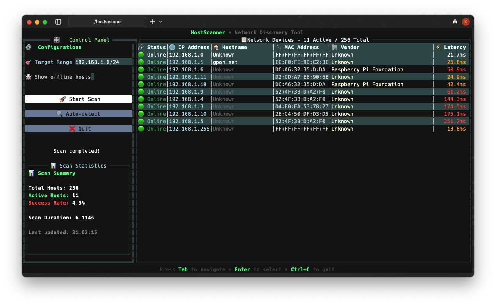

# HostScanner - Network Device Discovery Tool

A fast, modern, and beautiful network host discovery tool built with Go featuring a sleek Terminal UI (TUI) with professional styling.



## Why HostScanner?

**Simple. Focused. No Bloat.**

I was tired of installing heavyweight network tools with massive dependencies, complex GUIs, and hundreds of features I never use. Sometimes you just need a simple, fast tool that does exactly what you want - discover devices on your network - without the overhead.

HostScanner is built with this philosophy:
- 🎯 **Single purpose** - Network device discovery, done well
- 📦 **Zero dependencies** - Self-contained binary, no installation hassles
- ⚡ **Lightweight** - ~5MB executable vs hundreds of MB for alternatives
- 🚀 **Fast startup** - Instant launch, no loading screens or splash pages
- 🎨 **Clean interface** - Beautiful TUI without unnecessary complexity
- 💻 **Cross-platform** - Works on Windows, macOS, and Linux out of the box

Perfect for network admins, developers, and anyone who values simplicity and efficiency over feature bloat.

## Features

- 🚀 **Fast concurrent scanning** - High-performance worker pool for rapid network discovery
- 🎨 **Modern sleek UI** - Professional dark theme with color-coded results and progress bars
- 🔍 **Smart network discovery** - Auto-detect local networks or specify custom ranges
- 📊 **Rich device information** - MAC addresses, hostnames, vendor identification, and latency metrics
- ⚡ **Real-time feedback** - Live progress tracking with visual indicators and statistics
- 🎛️ **Intuitive controls** - Sidebar control panel with emoji-enhanced interface
- 🌐 **Multiple IP formats** - Support for CIDR, ranges, and single IP addresses
- 📈 **Performance optimized** - Pre-allocated data structures following Go best practices
- 🛡️ **Robust error handling** - Comprehensive error management with contextual information

## Installation

### Prerequisites

- Go 1.21 or later (tested with Go 1.24.5)
- Terminal with color support for best experience

### Build from Source

1. Clone or download the project:
```bash
# Clone the repository
git clone <your-repo-url>
cd hostscanner
```

2. Install dependencies:
```bash
go mod tidy
```

3. Build the application:
```bash
go build -o hostscanner .
```

4. (Optional) Install globally:
```bash
go install .
```

## Usage

Launch the interactive Terminal UI:
```bash
./hostscanner
```

### Modern TUI Features

The sleek Terminal UI provides:
- 🎛️ **Sidebar Control Panel** - Organized controls with modern styling and emoji icons
- 📋 **Professional Results Table** - Color-coded device information with alternating row colors
- 📊 **Live Statistics Panel** - Real-time scan metrics and success rates
- 🎯 **Smart Input Fields** - Target range input with format validation
- 🚀 **Dynamic Scan Button** - Visual state changes during scanning operations
- 📈 **Animated Progress Bar** - Visual progress tracking with percentage indicators
- 🌈 **Color-Coded Latency** - Green (<10ms), Orange (<50ms), Red (>50ms)
- 👻 **Toggle Options** - Show/hide offline hosts with intuitive controls
- 🔍 **Auto-Detection** - One-click local network discovery
- ✨ **Status Indicators** - Modern 🟢 Online / 🔴 Offline status with colors

### How to Use

1. **Launch the application:**
   ```bash
   ./hostscanner
   ```

2. **Enter IP range** or click "Auto-detect Local Network" to scan your local network

3. **Configure options:**
   - Check "Show inactive hosts" to see offline devices
   - Default range is `192.168.1.0/24`

4. **Click "Scan Network"** to start discovery

5. **View results** in the modern table with detailed information:
   - 🔗 Status (🟢 Online / 🔴 Offline) with color coding
   - 🌐 IP Address (highlighted in blue)
   - 🏠 Hostname (resolved when available)
   - 🔧 MAC Address (from ARP table)
   - 🏢 Vendor (identified from OUI database)
   - ⚡ Latency (color-coded by performance)

### Supported IP Range Formats

- **CIDR notation:** `192.168.1.0/24`
- **IP range:** `192.168.1.1-192.168.1.255`
- **Single IP:** `192.168.1.1`

## Development

### Running Tests

Run all tests:
```bash
go test ./...
```

Run tests with verbose output:
```bash
go test -v ./...
```

Run specific test package:
```bash
go test ./scanner -v
```

### Project Structure

```
hostscanner/
├── main.go                     # Modern Terminal UI application
├── scanner/
│   ├── scanner.go              # High-performance scanning engine
│   └── scanner_test.go         # Comprehensive unit tests
├── network/
│   ├── network.go              # IP range parsing and utilities
│   └── network_test.go         # Network functionality tests
├── go.mod                      # Go module definition
├── go.sum                      # Go module checksums
├── README.md                   # This documentation
└── hostscanner*                # Optimized executable
```

### Code Quality & Best Practices

This project follows industry-standard Go development practices:

- ✅ **Uber Go Style Guide** - Adheres to professional Go coding standards
- ✅ **Comprehensive Error Handling** - Structured error types with proper wrapping
- ✅ **Performance Optimized** - Pre-allocated data structures and efficient algorithms
- ✅ **Well Documented** - Complete API documentation for all public functions
- ✅ **Robust Testing** - Unit tests with good coverage for core functionality
- ✅ **Clean Architecture** - Modular design with clear separation of concerns
- ✅ **Memory Efficient** - Optimized memory usage with proper slice initialization
- ✅ **Concurrent Safe** - Thread-safe operations with proper synchronization

### Contributing

1. Fork the repository
2. Create a feature branch
3. Make your changes
4. Add tests if applicable
5. Run `go test ./...` to ensure tests pass
6. Submit a pull request

## Performance Tips

- **Adjust timeout**: Lower timeouts (100-500ms) for faster discovery, higher (2-5s) for accuracy
- **Limit IP range**: Scan only network segments you're interested in
- **Use appropriate thread count**: More threads = faster discovery, but may overwhelm the network

## Common Use Cases

- **Network Troubleshooting** - Discover all devices on your network to identify connectivity issues
- **Security Auditing** - Find all active devices to ensure no unauthorized access
- **Network Inventory** - Maintain an up-to-date list of all network devices
- **IoT Device Discovery** - Identify smart home devices and IoT equipment
- **Network Administration** - Monitor device connectivity and network health

## License

MIT License - see LICENSE file for details.

## Troubleshooting

### Permission Denied
Some systems may require elevated privileges for network scanning:
```bash
sudo ./hostscanner
```

### Firewall Issues
If scans are slow or incomplete, check if your firewall is blocking ICMP requests or ARP queries.

### High CPU Usage
The application uses concurrent scanning which may cause high CPU usage. The scanning runs in the background and shouldn't affect the UI responsiveness.
